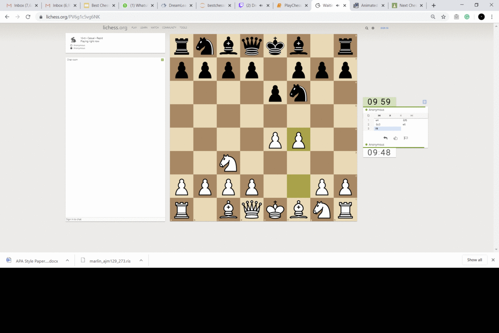

# bestchessmove
Give the user the next best chess move from Lichess-PC screen capture. Move suggestion given by stockfish chess engine. 

Explanation of GIF:

Step 1: Lichess website
Step 2: Capture the board
Step 3: Detect the cells based on vertical and horizontal lines
Step 4: Extract the cells based on the intersection of lines
Step 5: Detect each piece, and create a digital representation. Created a neural network to detect and identify each piece when given the cell snippet. 
Step 6: Convert the digital board to FEN notation. 
Step 7: Give the FEN to stockfish, and suggest a move. 

